<div align="center">

# BINARY는 호남선 NUM 행열 CHAR에

### LG Aimers 5기 해커톤 — **본선 6위**

[](https://python.org)
[](https://catboost.ai)
[](https://scikit-learn.org)

**스마트 공장 디스플레이 생산 공정 — 제품 이상 여부 판별 AI 모델**

> LG Aimers 5기 | Team: Binary는 호남선 NUM 행열 CHAR에 | 김진욱

</div>

---

## 📊 Result

| 구분 | 수치 |
|:---|:---|
| **최종 순위** | **본선 6위** |
| **Public Score** | 0.283208 (9위) |
| **Final Score** | 0.298906 (8위 → 최종 6위) |
| **Test AbNormal 예측 수** | 614개 |

> Public Score와 Final Score의 큰 차이가 없어 **강건한 모델**임을 증명

---

## 📑 발표 자료

---

### Slide 1 — 타이틀

<div align="center">
  
</div>

> **팀명: Binary는 호남선 NUM 행열 CHAR에**
> LG Aimers 5기 본선 발표 자료. 스마트 공장의 디스플레이 생산 공정 데이터를 활용하여 제품 이상 여부를 예측하는 AI 모델을 개발합니다.

---

### Slide 2 — 목차 (Contents)

<div align="center">
  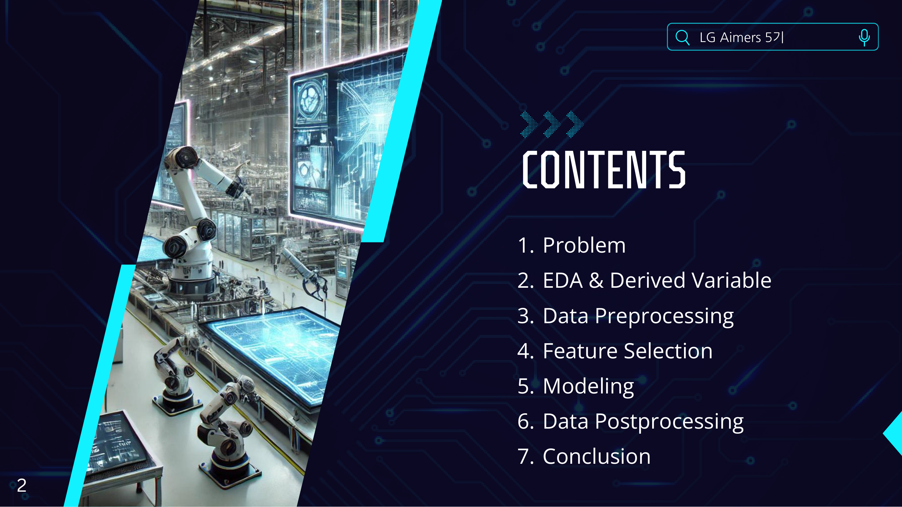
</div>

> **발표 순서**
> 1. Problem — 문제 정의
> 2. EDA & Derived Variable — 탐색적 데이터 분석 및 파생변수
> 3. Data Preprocessing — 데이터 전처리
> 4. Feature Selection — 특징 선택
> 5. Modeling — 모델링
> 6. Data Postprocessing — 후처리
> 7. Conclusion — 결론

---

### Slide 3 — Problem

<div align="center">
  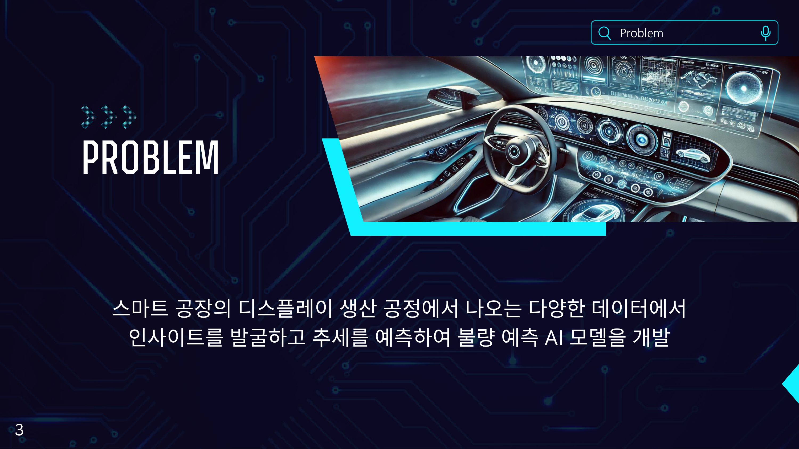
</div>

> **문제 정의**: 스마트 공장의 디스플레이 생산 공정에서 나오는 다양한 데이터에서 인사이트를 발굴하고 추세를 예측하여 **불량 예측 AI 모델을 개발**합니다.
>
> - 공정 데이터(Dam, Fill1, Fill2, AutoClave)에서 각 제품의 이상 여부(AbNormal/Normal)를 예측
> - 불균형(Imbalanced) 데이터셋에서의 정밀한 AbNormal 검출이 핵심 과제

---

### Slide 4 — Data Pre-processing (섹션)

<div align="center">
  
</div>

> **데이터 전처리 단계**: 결측치, 의미 중복, 이상치 처리 등 데이터 품질 개선 작업을 진행합니다.

---

### Slide 5 — Data Pre-processing: 결측치 & 변수 처리

<div align="center">
  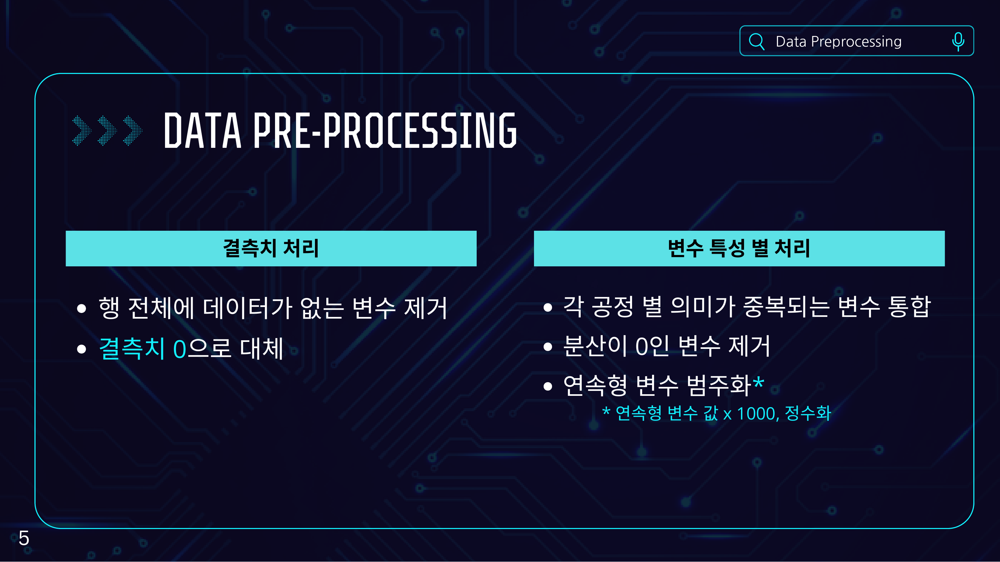
</div>

> **결측치 처리**
> - 행 전체에 데이터가 없는 변수 → 제거
> - 결측치 → 0으로 대체
>
> **변수 특성별 처리**
> - 각 공정별 의미가 중복되는 변수 통합
> - 분산이 0인 변수 제거
> - 연속형 변수 범주화 (값 × 1000 후 정수화)

---

### Slide 6 — Data Pre-processing: 의미 중복 & 이상치

<div align="center">
  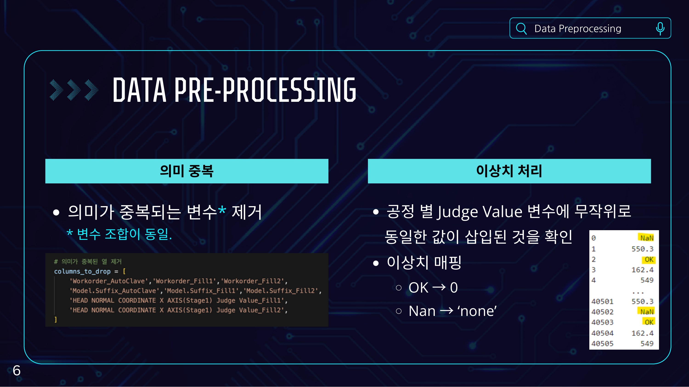
</div>

> **의미 중복 변수 제거**
> - 변수 조합이 동일한 컬럼 드롭 (Workorder, Suffix, AXIS 조합 등)
>
> **이상치 처리**
> - 공정별 Judge Value 컬럼에 무작위로 동일한 값이 삽입되어 있음을 확인
> - 이상치 매핑: `OK → 0`, `NaN → 'none'`

---

### Slide 7 — Hand Data 병합 (시간 범위 기준)

<div align="center">
  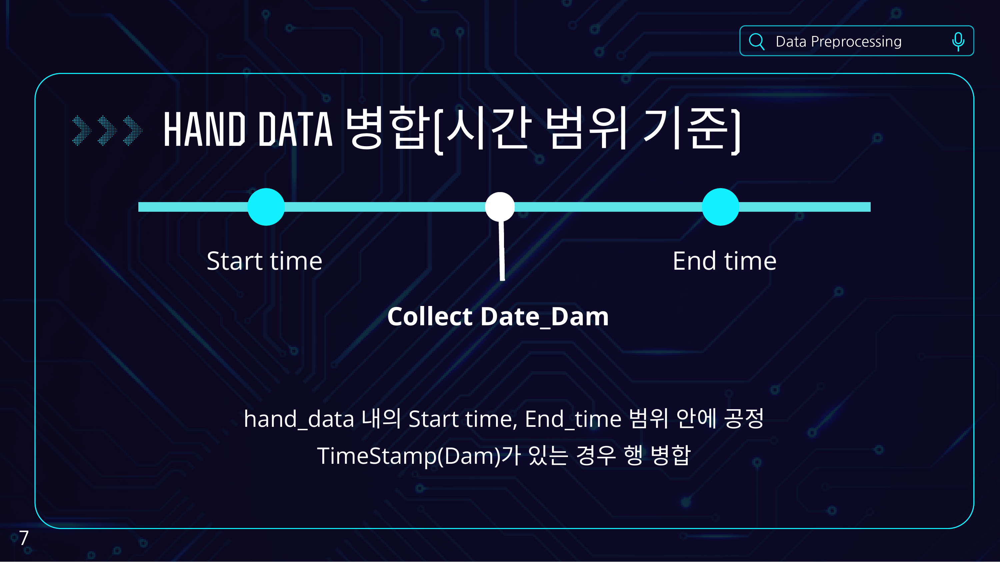
</div>

> **Hand Data 병합 전략**: `hand_data` 내의 Start time ~ End time 범위 안에 공정 `TimeStamp(Dam)`이 있는 경우 해당 행을 병합합니다.
>
> - 수기 데이터(핸드 라벨링)를 시간 기반으로 공정 데이터와 연결
> - 범위 내 데이터가 없으면 NaN으로 채움

---

### Slide 8 — EDA & Derived Variable (섹션)

<div align="center">
  
</div>

> **EDA 및 파생변수 생성 단계**: 탐색적 데이터 분석을 통해 도메인 지식 기반의 파생변수를 생성합니다.

---

### Slide 9 — SPLIT_DATE (날짜 변수 분리)

<div align="center">
  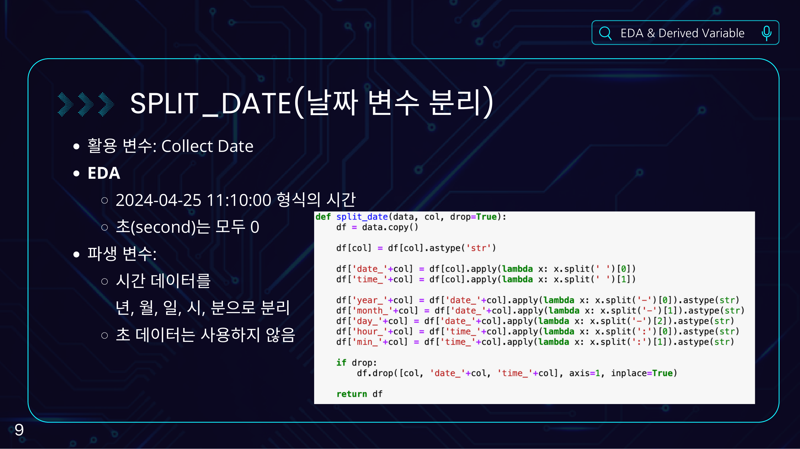
</div>

> **활용 변수**: `Collect Date`
>
> **EDA**: `2024-04-25 11:10:00` 형식의 시간 데이터, 초(second)는 모두 0
>
> **파생변수**: 시간 데이터를 **년, 월, 일, 시, 분**으로 분리 (초는 정보 없음으로 제외)

---

### Slide 10 — EQUIPMENT_MATCH (공정별 장비 일치 여부)

<div align="center">
  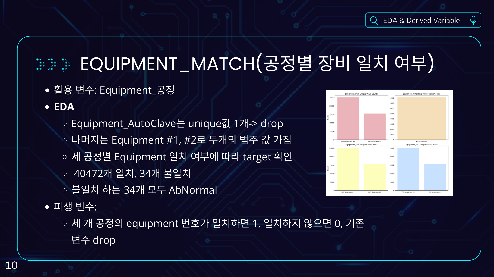
</div>

> **활용 변수**: `Equipment_공정`
>
> **EDA**:
> - Equipment_AutoClave → unique 값 1개 → 드롭
> - 나머지 Equipment #1, #2 두 가지 범주 보유
> - 세 공정별 장비 불일치 34건 → 모두 AbNormal
>
> **파생변수**: 세 공정의 장비 번호 일치 시 `1`, 불일치 시 `0`, 기존 변수 드롭

---

### Slide 11 — EQUIPMENT_MATCH (상세 — Stage별 Circle Distance Speed)

<div align="center">
  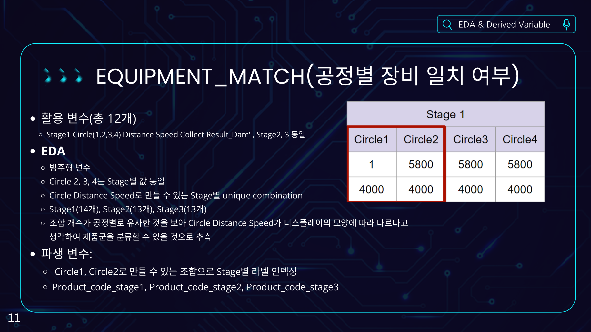
</div>

> **Circle Distance Speed 분석**:
> - `Stage1 Circle(1,2,3,4) Distance Speed`: Stage별 Circle 값의 조합으로 **Stage 라벨 인덱싱**
> - `Product_code_stage1/2/3` → Stage별 Circle1·2 조합으로 만든 제품군 코드

---

### Slide 12 — PRODUCT_CODE (통합 제품군 분류)

<div align="center">
  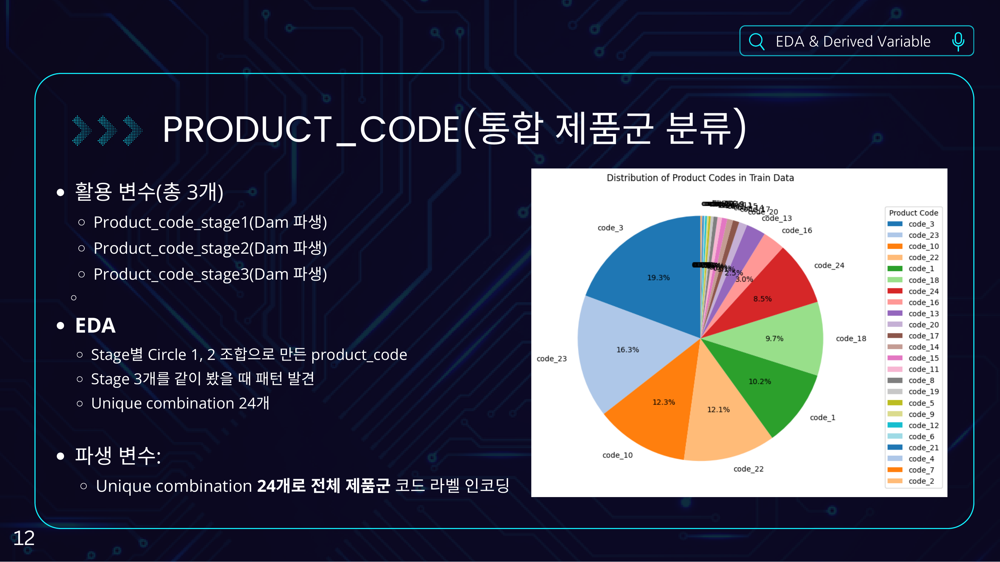
</div>

> **활용 변수**: `Product_code_stage1`, `Product_code_stage2`, `Product_code_stage3` (Dam 파생)
>
> **EDA**:
> - Stage별 Circle 1·2 조합으로 만든 제품 코드
> - 3개 Stage 조합 시 **Unique combination 24개** 발견 → `code_1` ~ `code_24`로 라벨 인코딩
>
> **파생변수**: 24개 제품군을 하나의 `code` 변수로 통합

---

### Slide 13 — 독립변수 간 상관관계

<div align="center">
  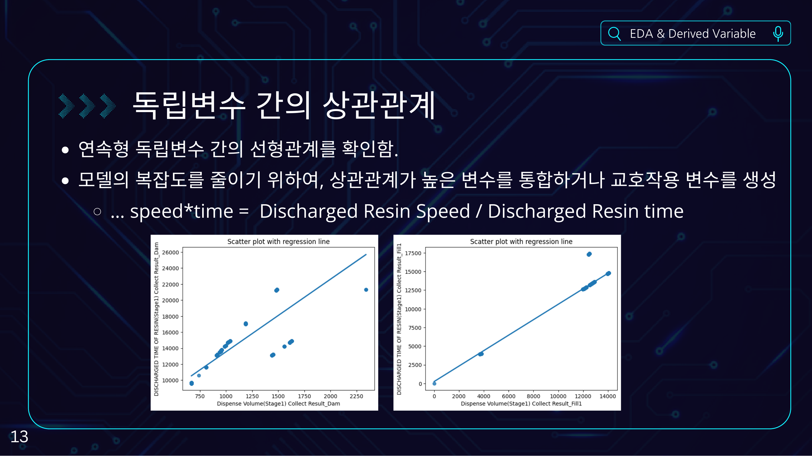
</div>

> **연속형 독립변수 간 선형관계** 확인:
> - 모델 복잡도 감소를 위해 상관관계 높은 변수 통합 또는 교호작용 변수 생성
> - 예: `speed × time = Discharged Resin Speed / Discharged Resin Time`으로 상호작용 특징 생성

---

### Slide 14 — SUM_POSITION (좌표 변수 통합)

<div align="center">
  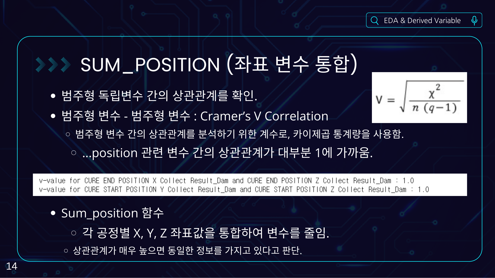
</div>

> **범주형 변수 — 범주형 변수 상관관계**: Cramer's V Correlation
>
> $$V = \sqrt{\frac{\chi^2}{n(q-1)}}$$
>
> - Position 관련 변수 간 상관관계가 대부분 **1에 가까움**
> - `Sum_position` 함수: 같은 공정의 같은 기계 X, Y, Z 좌표값을 더하여 변수 수 감소

---

### Slide 15 — SUM_POSITION (상세)

<div align="center">
  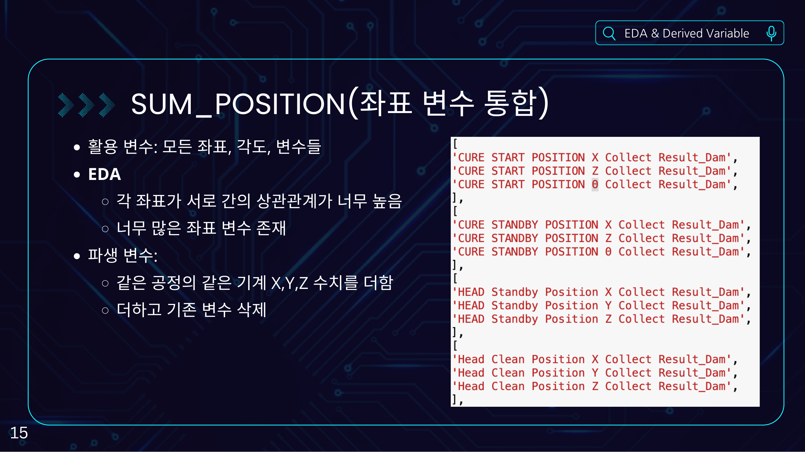
</div>

> **통합 대상 변수 예시**:
> - `CURE START POSITION X/Z/Θ Collect Result_Dam` → 합산 후 드롭
> - `CURE STANDBY POSITION X/Z/Θ` → 합산
> - `HEAD Standby Position X/Y/Z` → 합산
> - `Head Clean/Purge Position X/Y/Z` → 합산
>
> 각 공정(Dam, Fill1, Fill2)별 위치 관련 변수들을 모두 X+Y+Z 합계로 대체

---

### Slide 16 — TIME_DIFFERENCE (공정간 시간차)

<div align="center">
  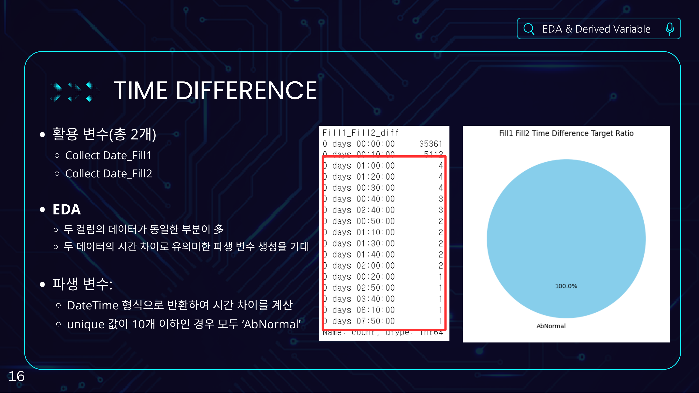
</div>

> **활용 변수**: `Collect Date_Fill1`, `Collect Date_Fill2`
>
> **EDA**:
> - 두 공정의 데이터가 동일한 부분이 많음
> - 두 Fill 공정의 시간 차이에서 유의미한 파생변수 생성 기대
>
> **파생변수**: DateTime 형식으로 변환 후 시간 차이 계산 → unique 값 10개 이하인 경우 'AbNormal'로 처리

---

### Slide 17 — Feature Selection

<div align="center">
  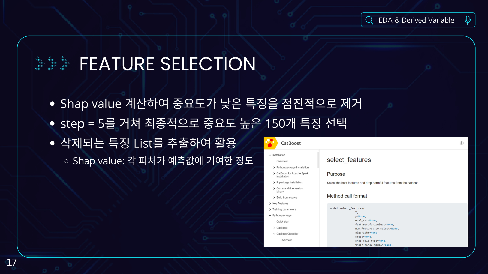
</div>

> **CatBoost `select_features` 활용**:
> - SHAP value 계산하여 중요도 낮은 특징 점진적으로 제거
> - `steps = 5`를 거쳐 최종 **150개 특징 선택**
> - 삭제되는 특징 리스트를 추출하여 재활용

---

### Slide 18 — Modeling (섹션)

<div align="center">
  
</div>

> **모델링 전략**: Stratified K-Fold, CatBoost, Soft Voting → Stacking Ensemble

---

### Slide 19 — Stratified K-Fold 데이터셋 증식

<div align="center">
  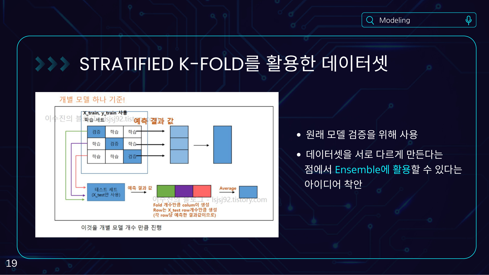
</div>

> **Stratified K-Fold 활용 이유**:
> - 원래 모델 검증을 위해 사용
> - **데이터셋을 서로 다르게 만들어 Ensemble에 활용**한다는 아이디어 착안
> - 개별 모델을 Fold 개수만큼 진행

---

### Slide 20 — K-Fold 데이터셋 → 각 모델별 예측값 생성

<div align="center">
  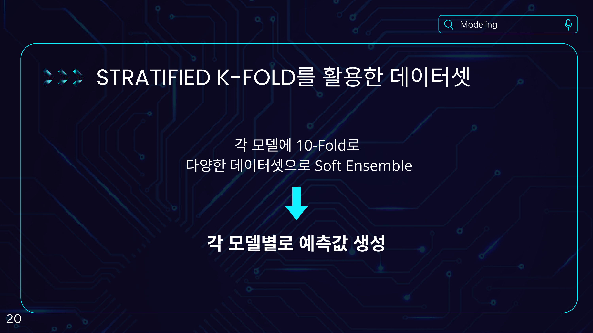
</div>

> **학습 전략**:
> - 각 모델에 10-Fold로 다양한 데이터셋 제공
> - Soft Ensemble → **각 모델별 예측값 생성**
> - 이를 통해 Stacking Ensemble의 입력으로 활용

---

### Slide 21 — Soft Voting Ensemble (→ Stacking)

<div align="center">
  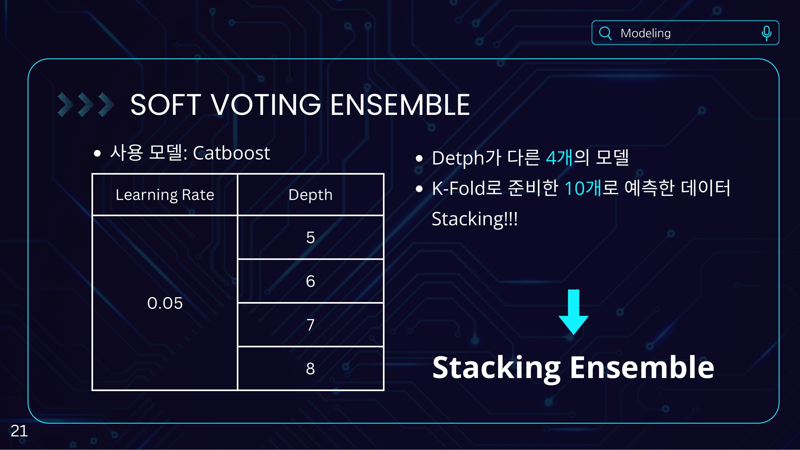
</div>

> **사용 모델**: CatBoost (Learning Rate=0.05, Depth: 5/6/7/8)
>
> - Depth가 다른 **4개의 모델**
> - K-Fold로 준비한 **10개** 데이터셋으로 예측
> - 결과: **40개(4 depth × 10 fold)의 예측값 → Stacking Ensemble**

---

### Slide 22 — Model Architecture

<div align="center">
  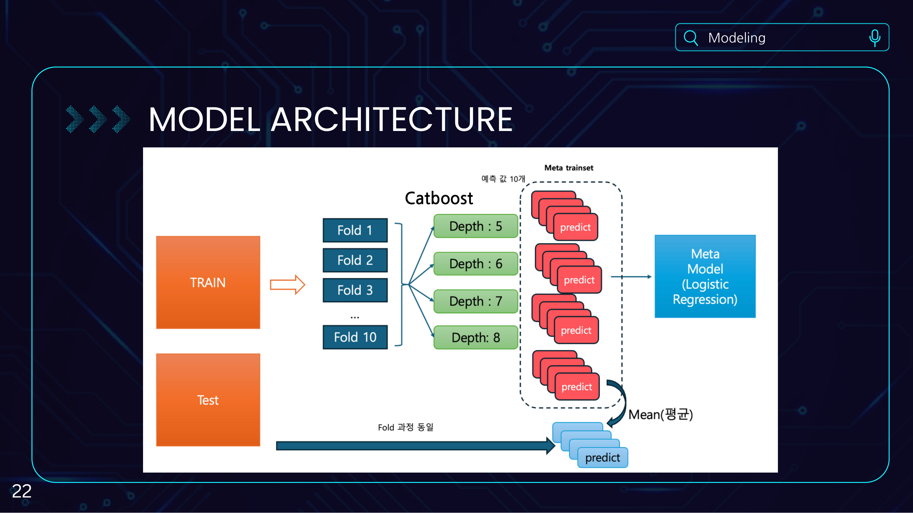
</div>

> **전체 모델 구조**:
>
> ```
> TRAIN → [Fold 1~10] → CatBoost(Depth 5,6,7,8) → 예측값 10개 → Meta Trainset
>                                                                      ↓
> TEST  → [Fold 과정 동일] → predict(평균) ──────────────→ Meta Model (Logistic Regression)
> ```
>
> - Base 모델: CatBoost × 4 depth × 10 fold = **총 40개 독립 모델**
> - Meta 모델: Logistic Regression (스태킹 앙상블)

---

### Slide 23 — Precision-Recall Trade-Off

<div align="center">
  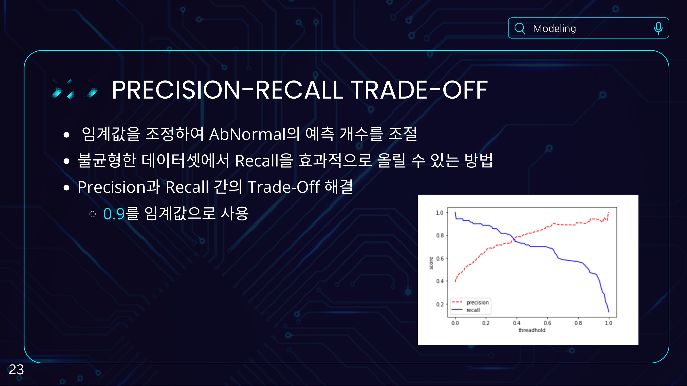
</div>

> **임계값 조정으로 AbNormal 예측 수 조절**:
> - 불균형 데이터셋에서 Recall을 효과적으로 올릴 수 있는 방법
> - Precision과 Recall 간의 Trade-Off 해결
> - **임계값 0.9** 사용: `predict_proba < 0.9 → AbNormal`

---

### Slide 24 — Post Processing (섹션)

<div align="center">
  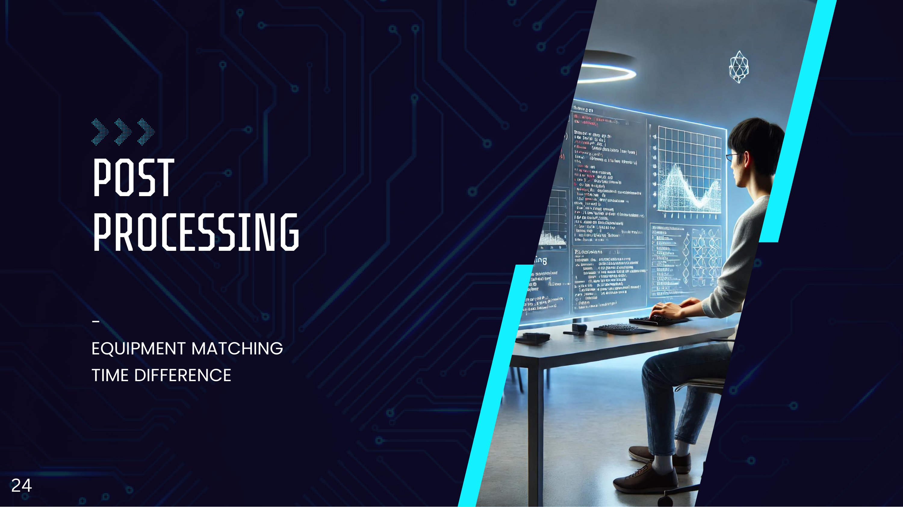
</div>

> **후처리 단계**: Equipment Matching, Time Difference 기반 핸드 라벨링

---

### Slide 25 — Post Processing (상세)

<div align="center">
  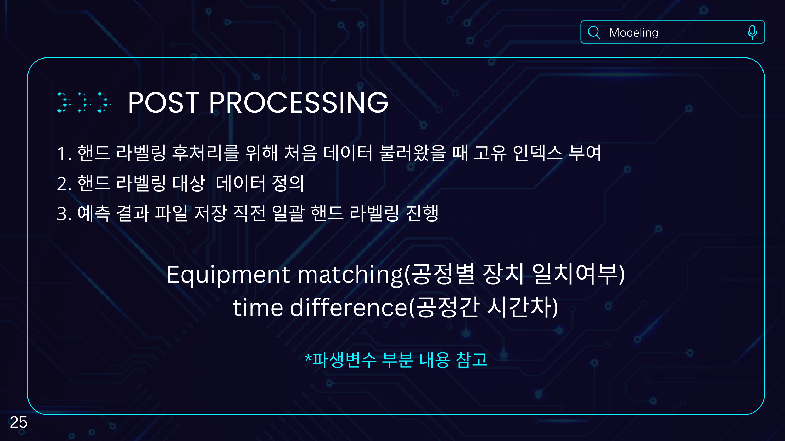
</div>

> **후처리 절차**:
> 1. 핸드 라벨링 후처리를 위해 처음 데이터 불러왔을 때 고유 인덱스 부여
> 2. 핸드 라벨링 대상 데이터 정의
> 3. 예측 결과 파일 저장 직전 일괄 핸드 라벨링 진행
>
> 적용 기준:
> - `Equipment matching` (공정별 장비 불일치) → AbNormal 처리
> - `Time difference` (공정간 시간차 비정상) → AbNormal 처리

---

### Slide 26 — Conclusion (섹션)

<div align="center">
  
</div>

---

### Slide 27 — Summary

<div align="center">
  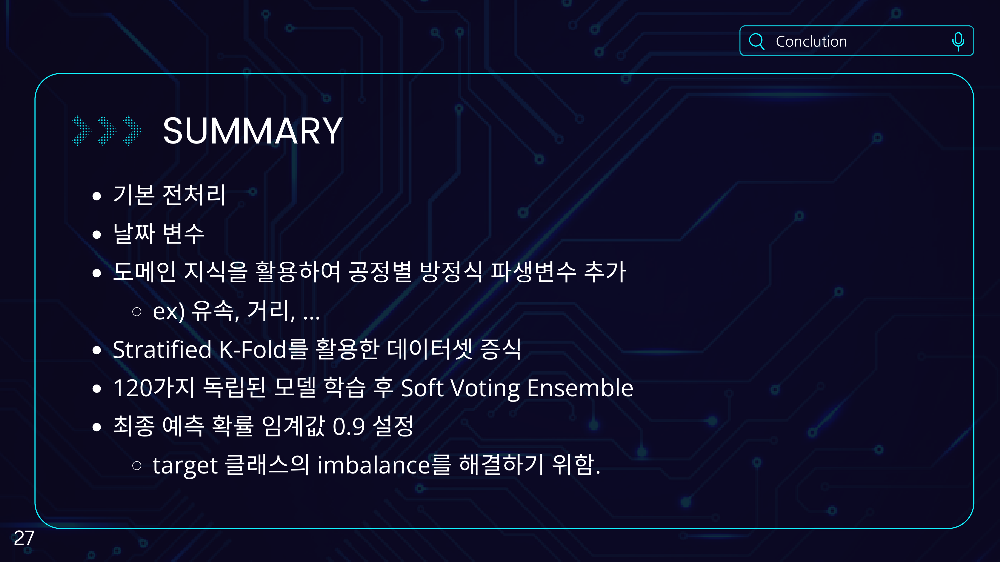
</div>

> **최종 접근법 요약**:
> - 기본 전처리 (결측치, 이상치, 중복 제거)
> - 날짜 변수 분리
> - 도메인 지식을 활용한 공정별 방정식 파생변수 추가 (ex. 유속, 거리 등)
> - **Stratified K-Fold를 활용한 데이터셋 증식**
> - **120가지 독립된 모델** 학습 후 Soft Voting Ensemble
> - 최종 예측 확률 임계값 **0.9** 설정 (target 클래스 imbalance 해결)

---

### Slide 28 — Result

<div align="center">
  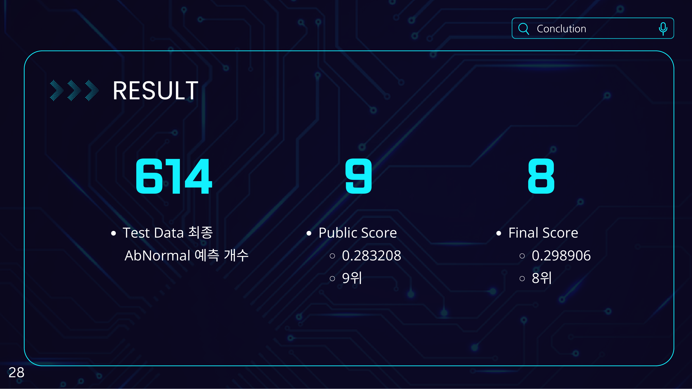
</div>

> | 지표 | 값 |
> |:---|:---|
> | Test Data 최종 AbNormal 예측 개수 | **614개** |
> | Public Score | **0.283208** (9위) |
> | Final Score | **0.298906** (8위 → 최종 **6위**) |

---

### Slide 29 — Conclusion

<div align="center">
  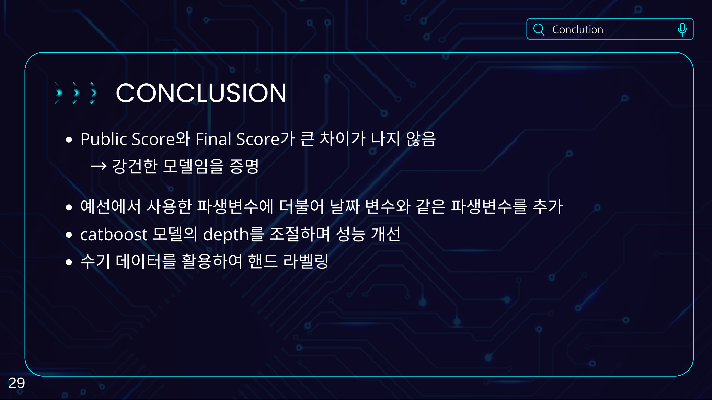
</div>

> - Public Score와 Final Score가 큰 차이 없음 → **강건한 모델** 증명
> - 예선에서 사용한 파생변수 + **날짜 변수** 같은 파생변수 추가
> - CatBoost 모델의 **depth를 조절**하며 성능 개선
> - **수기 데이터**를 활용하여 핸드 라벨링 적용

---

### Slide 30 — Thank You

<div align="center">
  
</div>

---

## 📦 데이터 구조

대회에서 제공된 데이터는 디스플레이 생산 공정(Dam → Fill1 → Fill2 → AutoClave) 4단계의 공정 파라미터로 구성됩니다.

```
data/
├── train.csv        # 학습 데이터 (40,506행 × 500+열)
├── test.csv         # 테스트 데이터 (17,361행)
├── hand_data.xlsx   # 수기 라벨링 데이터 (시간 범위 기반 병합)
└── submission.csv   # 제출 파일
```

| 컬럼 구분 | 설명 |
|:---|:---|
| `*_Dam` | Dam 공정 파라미터 (수지 도포) |
| `*_Fill1` | Fill1 공정 파라미터 (1차 충전) |
| `*_Fill2` | Fill2 공정 파라미터 (2차 충전) |
| `*_AutoClave` | AutoClave 공정 파라미터 (고압 처리) |
| `target` | 제품 이상 여부 (`Normal` / `AbNormal`) |

---

## 🔑 핵심 코드 설명

### 1. 날짜 변수 분리 (`split_date`)

```python
def split_date(data, col, drop=True):
    df = data.copy()
    df[col] = df[col].astype('str')
    df['year_'+col]  = df['date_'+col].apply(lambda x: x.split('-')[0]).astype(str)
    df['month_'+col] = df['date_'+col].apply(lambda x: x.split('-')[1]).astype(str)
    df['day_'+col]   = df['date_'+col].apply(lambda x: x.split('-')[2]).astype(str)
    df['hour_'+col]  = df['time_'+col].apply(lambda x: x.split(':')[0]).astype(str)
    df['min_'+col]   = df['time_'+col].apply(lambda x: x.split(':')[1]).astype(str)
    if drop:
        df.drop([col, 'date_'+col, 'time_'+col], axis=1, inplace=True)
    return df
```

> `Collect Date_Dam/Fill1/Fill2/AutoClave` 4개 컬럼을 각각 **년·월·일·시·분** 5개 파생변수로 분리합니다. 초(second)는 모두 0이므로 제외합니다.

---

### 2. 공정별 장비 일치 여부 (`add_equipment_match_column`)

```python
def add_equipment_match_column(df):
    last_char_dam   = df["Equipment_Dam"].str[-1]
    last_char_fill1 = df["Equipment_Fill1"].str[-1]
    last_char_fill2 = df["Equipment_Fill2"].str[-1]
    df['equipment_match'] = ((last_char_dam == last_char_fill1) &
                             (last_char_fill1 == last_char_fill2)).astype(int)
    return df
```

> Dam, Fill1, Fill2 공정에서 사용한 장비 번호(마지막 자리)가 모두 일치하면 `1`, 하나라도 다르면 `0`. 장비 불일치 34건은 **모두 AbNormal**이었기 때문에 후처리에도 활용합니다.

---

### 3. Hand Data 시간 범위 기준 병합 (`process_and_merge_data`)

```python
matching_hand_data = df[
    (input_row['Collect Date_Dam'] >= df['start_time']) &
    (input_row['Collect Date_Dam'] <= df['end_time'])
]
```

> 수기 데이터(`hand_data.xlsx`)의 Start time ~ End time 범위 내에 공정 타임스탬프가 있으면 해당 행을 병합합니다. 범위 외의 경우 NaN으로 채웁니다.

---

### 4. 좌표 변수 합산 (`sum_positions`)

```python
def sum_positions(data, sum_cols, drop=True):
    for col in sum_cols:
        sum_col = col[0] + "_sum"
        df[sum_col] = df[col].sum(axis=1).astype(int)
        if drop:
            df = df.drop(col, axis=1)
    return df
```

> 같은 기계의 X/Y/Z(또는 X/Z/Θ) 좌표들은 Cramer's V 상관계수가 거의 1에 수렴하므로, **세 값을 합산한 하나의 변수**로 대체하여 차원을 줄입니다.

---

### 5. 제품군 코드 생성 (`add_product_code_stages` + `update_code_column`)

```python
# Stage별 Circle1·Circle2 Distance Speed 조합으로 제품군 코드 생성
for key, value in Stage1_product_mapping.items():
    stage2_value, stage1_value = key
    df.loc[(df['Stage1 Circle2 ...'].astype(str) == stage2_value) &
           (df['Stage1 Circle1 ...'].astype(str) == stage1_value),
           'product_code_stage1'] = value

# 3개 Stage 조합으로 최종 code_1 ~ code_24 분류
for key, value in code_mapping.items():
    stage1_num, stage2_num, stage3_num = key
    df.loc[(df['product_code_stage1'] == f'Stage1_{stage1_num}') &
           (df['product_code_stage2'] == f'Stage2_{stage2_num}') &
           (df['product_code_stage3'] == f'Stage3_{stage3_num}'), 'code'] = value
```

> Stage 1·2·3의 Circle Distance Speed 조합에서 각 Stage별 제품군을 정의하고, 3개 Stage 조합으로 **최종 24개 제품군 코드**(`code_1` ~ `code_24`)를 생성합니다.

---

### 6. Stacking Ensemble 학습 (`train_stacking_ensemble_model`)

```python
params = [
    {'learning_rate': 0.05, 'eval_metric': 'F1', 'depth': 5},
    {'learning_rate': 0.05, 'eval_metric': 'F1', 'depth': 6},
    {'learning_rate': 0.05, 'eval_metric': 'F1', 'depth': 7},
    {'learning_rate': 0.05, 'eval_metric': 'F1', 'depth': 8},
]

# Stage 1: CatBoost base 모델 (4 depth × 10 fold = 40개)
for param in params:
    for X_train, y_tr, X_val, y_val in datasets:  # 10-Fold datasets
        model = CatBoostClassifier(**param, iterations=1000, task_type='GPU')
        model.fit(train_pool, eval_set=eval_pool)
        fold_train_predictions.append(model.predict_proba(X_val)[:, 1])

# Stage 2: Meta 모델 (Logistic Regression)
meta_model = LogisticRegression()
meta_model.fit(X_meta_train, y_meta_train)  # X_meta_train: 40개 base 모델 예측값
```

> **4가지 depth(5~8) × 10-Fold = 40개**의 독립적인 CatBoost 모델을 학습하고, 각 모델의 예측 확률을 Meta Trainset으로 구성해 **Logistic Regression 메타 모델**로 최종 앙상블합니다.

---

### 7. Precision-Recall 임계값 조정 & 후처리

```python
# 임계값 0.9 적용 (predict_proba < 0.9 → AbNormal)
final_test_pred = np.where(final_test_prob < 0.9, 'AbNormal', 'Normal')

# 후처리: 장비 불일치 & 시간차 이상 → 강제 AbNormal
df_sub.iloc[abnormal_em_index]['target'] = 'AbNormal'   # 장비 불일치
df_sub.iloc[abnormal_diff_index]['target'] = 'AbNormal'  # 시간차 이상
```

> 불균형 데이터셋에서 AbNormal Recall을 높이기 위해 **임계값을 0.9**로 낮춥니다 (확률이 0.9 미만이면 AbNormal로 분류). 추가로 장비 불일치 / Fill 공정간 시간차 이상 케이스는 규칙 기반으로 강제 AbNormal 처리합니다.

---

## 🛠️ Tech Stack

| 분류 | 기술 |
|:---|:---|
| **언어** | Python 3.10 |
| **모델** | CatBoost (Gradient Boosting) |
| **앙상블** | Stratified K-Fold + Stacking (Logistic Regression Meta) |
| **특징 선택** | SHAP Value 기반 CatBoost `select_features` |
| **데이터 처리** | pandas, numpy |
| **평가 지표** | F1 Score (불균형 데이터 고려) |

---

<div align="center">
  <b>🏅 LG Aimers 5기 — 본선 6위</b><br>
  <i>Team: Binary는 호남선 NUM 행열 CHAR에 | 김진욱</i>
</div>
